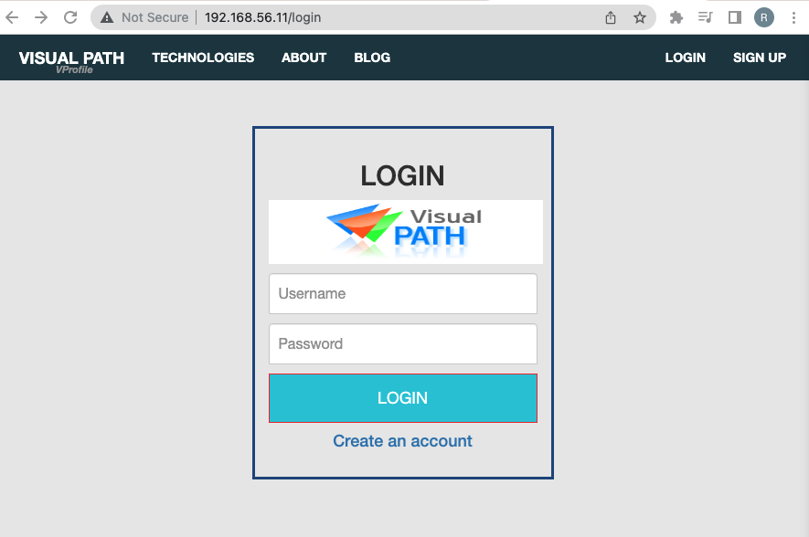
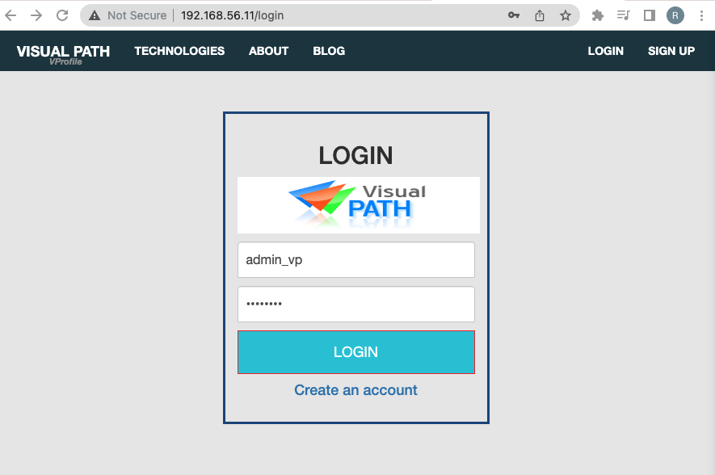
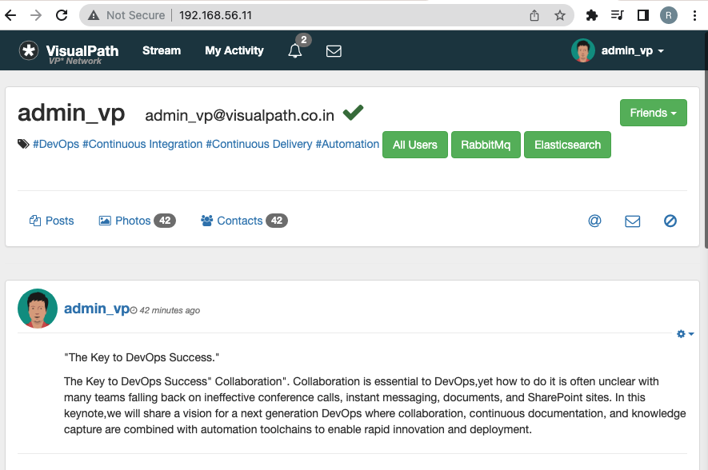
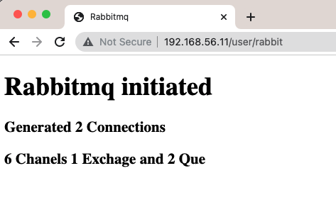
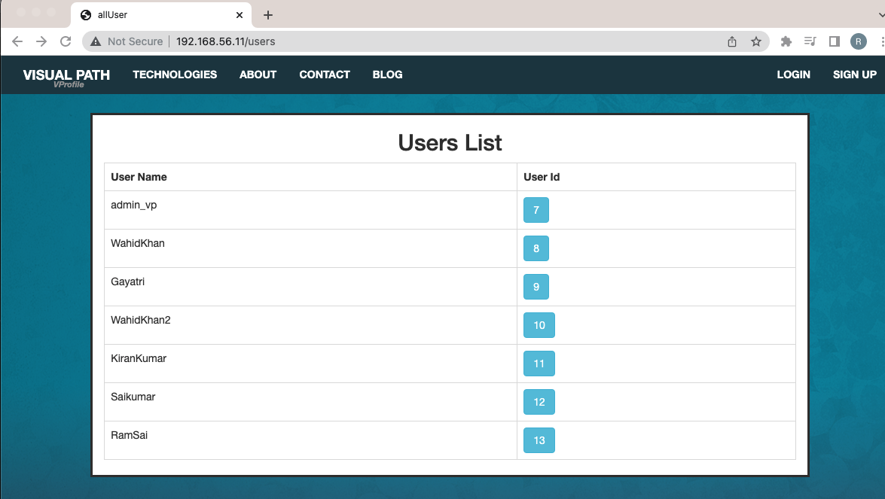
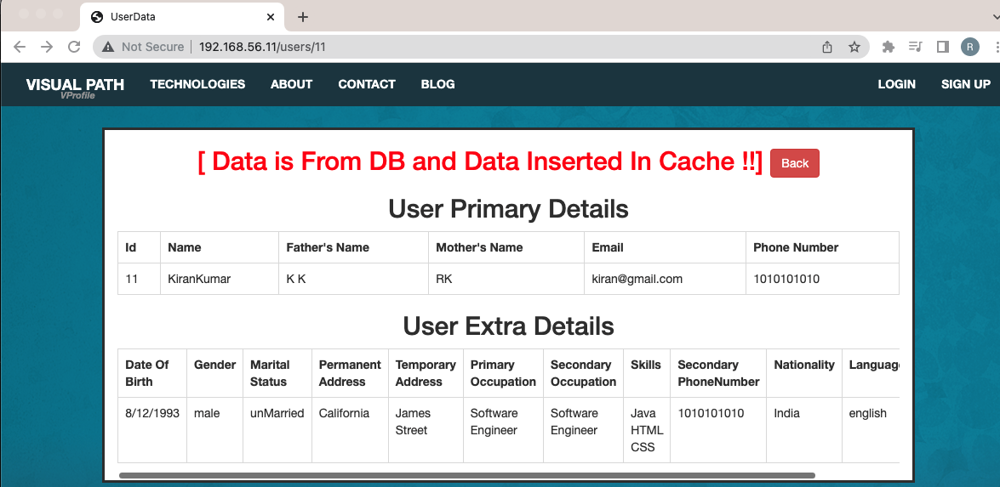
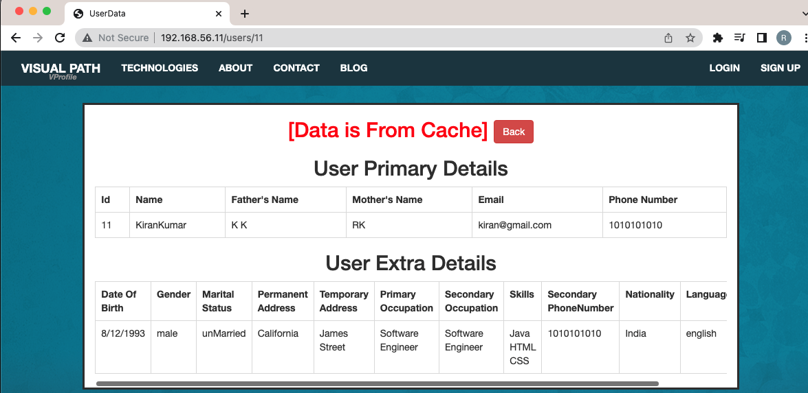

<a name="readme-top"></a>

<!-- [![Contributors][contributors-shield]][contributors-url]
[![Forks][forks-shield]][forks-url]
[![Stargazers][stars-shield]][stars-url]
[![Issues][issues-shield]][issues-url]
[![MIT License][license-shield]][license-url]
[![LinkedIn][linkedin-shield]][linkedin-url] -->

<!-- PROJECT LOGO -->
<br />
<div align="center">
  <a href="">
    
  </a>

  <h3 align="center">DevOps Project 2</h3>

  <p align="center">
    Multi Tier Application Stack Setup Locally - Automated
  </p>
</div>

## About The Project

<p align="left">
  
</p>

A web application stack (Vprofile project local). It's a multi tier web application stack setup on a Laptop/Desktop.
This project will be set up automatically.Once `vagrant up` up command is executed from the directory where the vagrantfie is located all the VMs will be provisioned automatically as well as all the services nginx, tomcat, mysql, rabbitmq, and memcached.

Here's why:

- This project will be a baseline for other projects.
- To setup a local development Lab.:smile:

### Built With

- [![Vagrant][vagrant]][vagrant]
- [![VirtualBox][virtualbox]][virtualbox]
- [![Tomcat][tomcat]][tomcat]
- [![RabbitMQ][rabbitmq]][rabbitmq]
- [![Memcache][memcache]][memcache]
- [![Nginx][nginx]][nginx]
- [![MySQL][mysql]][mysql]
- [![Bash][bash_script]][bash_script]

<p align="right">(<a href="#readme-top">back to top</a>)</p>

<!-- GETTING STARTED -->

## Getting Started

### Prerequisites

<ul style="text-decoration: none;">
  <li>
    <p> Install Oracle VM Virtualbox </p>
  </li>
  <li>
    <p> Install Vagrant </p>
  </li>
  <li>
    <p> Install Vagrant plugins </p>
    <ul>
        <li>vagrant plugin install vagrant-hostmanager</li>
        <li>vagrant plugin install vagrant-vbguest</li>
    </ul>
  </li>
  <li>
    <p> Install Git bash or equivalent editor </p>
  </li>

</ul>

#### 🧾 Steps

#### 1 - Setup Virtual Machines and Provision services

- Clone repository

  ```sh
  git clone https://github.com/devopshydclub/vprofile-project

  ```

- Navigate to the directory where the Vagrantfile exists

  ```sh
   cd vagrantfile directory

  ```

- Install plugins

  ```sh
   vagrant plugin install vagrant-hostmanager

  ```

- Spin up VMs and Provision services

  ```sh
   vagrant up

  ```

Ensure VMs are running, your VM dashboard should be similar to this.

[![VMs Running][vms-are-running-in-virtualbox]]

### Validate Application from Browser

- We are in web01 server, run `ifconfig` to get its IP address. So the IP address of our web01 is : `192.168.56.11`

```sh
enp0s8: flags=4163<UP,BROADCAST,RUNNING,MULTICAST>  mtu 1500
        inet 192.168.56.11
```

- First validate Nginx is running on browser `http://<IP_of_Nginx_server>`.
  

- Validate Db connection using credentials `admin_vp` for both username and password.



- Validate app is running from Tomcat server



- Validate RabbitMQ connection by clicking RabbitMQ



- Validate Memcache connection by clicking MemCache



- Validate data is coming from Database when user first time requests it.



- Validate data is coming from Memcached when user second time requests it.



### CleanUp

- We will got to the directory that we have `Vagrantfile`, and run below command to destroy all virtual machines.

```sh
vagrant destroy
```


- Check Oracle VM VirtualBox Manager if Vms are destroyed.


<!-- ACKNOWLEDGMENTS -->

## Acknowledgments

Use this space to list resources you find helpful and would like to give credit to. I've included a few of my favorites to kick things off!

- [Choose an Open Source License](https://choosealicense.com)
- [GitHub Emoji Cheat Sheet](https://www.webpagefx.com/tools/emoji-cheat-sheet)
- [Img Shields](https://shields.io)
- [Rumeysa Dogan](https://github.com/rumeysakdogan)
- [Imran](https://github.com/devopshydclub)

<p align="right">(<a href="#readme-top">back to top</a>)</p>

<!-- MARKDOWN LINKS & screenshoot -->
<!-- https://www.markdownguide.org/basic-syntax/#reference-style-links -->

[contributors-shield]: https://img.shields.io/github/contributors/othneildrew/Best-README-Template.svg?style=for-the-badge
[contributors-url]: https://github.com/othneildrew/Best-README-Template/graphs/contributors
[forks-shield]: https://img.shields.io/github/forks/othneildrew/Best-README-Template.svg?style=for-the-badge
[forks-url]: https://github.com/othneildrew/Best-README-Template/network/members
[stars-shield]: https://img.shields.io/github/stars/othneildrew/Best-README-Template.svg?style=for-the-badge
[stars-url]: https://github.com/othneildrew/Best-README-Template/stargazers
[issues-shield]: https://img.shields.io/github/issues/othneildrew/Best-README-Template.svg?style=for-the-badge
[issues-url]: https://github.com/othneildrew/Best-README-Template/issues
[license-shield]: https://img.shields.io/github/license/othneildrew/Best-README-Template.svg?style=for-the-badge
[license-url]: https://github.com/othneildrew/Best-README-Template/blob/master/LICENSE.txt
[linkedin-shield]: https://img.shields.io/badge/-LinkedIn-black.svg?style=for-the-badge&logo=linkedin&colorB=555
[linkedin-url]: https://linkedin.com/in/othneildrew
[product-screenshot]: screenshoot/screenshot.png
[vms-are-running-in-virtualbox]: screenshoot/VMs-are-running-in-VirtualBox.png
[host-files-output]: screenshoot/connected-web01-via-ssh.png
[ping-output]: screenshoot/pinging-app01-from-web01.png
[next.js]: https://img.shields.io/badge/next.js-000000?style=for-the-badge&logo=nextdotjs&logoColor=white
[next-url]: https://nextjs.org/
[react.js]: https://img.shields.io/badge/React-20232A?style=for-the-badge&logo=react&logoColor=61DAFB
[react-url]: https://reactjs.org/
[vue.js]: https://img.shields.io/badge/Vue.js-35495E?style=for-the-badge&logo=vuedotjs&logoColor=4FC08D
[vue-url]: https://vuejs.org/
[angular.io]: https://img.shields.io/badge/Angular-DD0031?style=for-the-badge&logo=angular&logoColor=white
[angular-url]: https://angular.io/
[svelte.dev]: https://img.shields.io/badge/Svelte-4A4A55?style=for-the-badge&logo=svelte&logoColor=FF3E00
[svelte-url]: https://svelte.dev/
[laravel.com]: https://img.shields.io/badge/Laravel-FF2D20?style=for-the-badge&logo=laravel&logoColor=white
[laravel-url]: https://laravel.com
[bootstrap.com]: https://img.shields.io/badge/Bootstrap-563D7C?style=for-the-badge&logo=bootstrap&logoColor=white
[bootstrap-url]: https://getbootstrap.com
[jquery.com]: https://img.shields.io/badge/jQuery-0769AD?style=for-the-badge&logo=jquery&logoColor=white
[jquery-url]: https://jquery.com
[vagrant]: https://img.shields.io/badge/Vagrant-Vagrant-orange
[virtualbox]: https://img.shields.io/badge/Virtualbox-Virtualbox-orange
[nginx]: https://img.shields.io/badge/Nginx-Nginx-orange
[tomcat]: https://img.shields.io/badge/tomcat-tomcat-orange
[rabbitmq]: https://img.shields.io/badge/rabitmq-rabitmq-orange
[memcache]: https://img.shields.io/badge/memcache-memcache-orange
[mysql]: https://img.shields.io/badge/mysql-mysql-orange
[bash_script]: https://img.shields.io/badge/bash-bash-black
